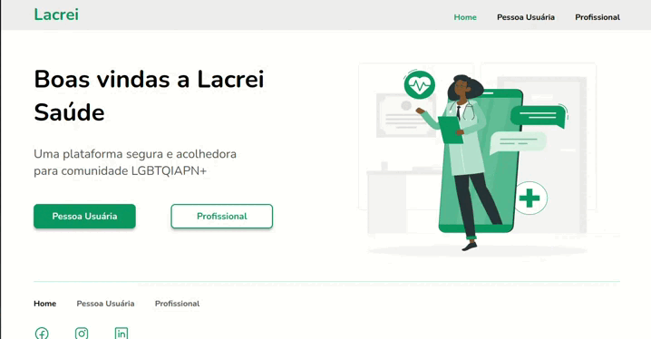

# Desafio Lacrei 💅🏽

O desafio consistia em criar um Page da Empresa Lacrei
com intuito de divulgar informações dos propósitos da empresa. 

## ⚙️ Tecnologias

- React
- TypeScript
- Vite
- Styled Components
- Jest

## 🚀 Instalação e execução

Para conseguir executar a aplicação use os comandos abaixo:

### 1 - Na raíz do projeto:
    
    npm install

    npm run dev
   
### 2 - Para rodar os testes, execute:

    npm run test
    
    
## 💻 Funcionalidades 

  
🍀

